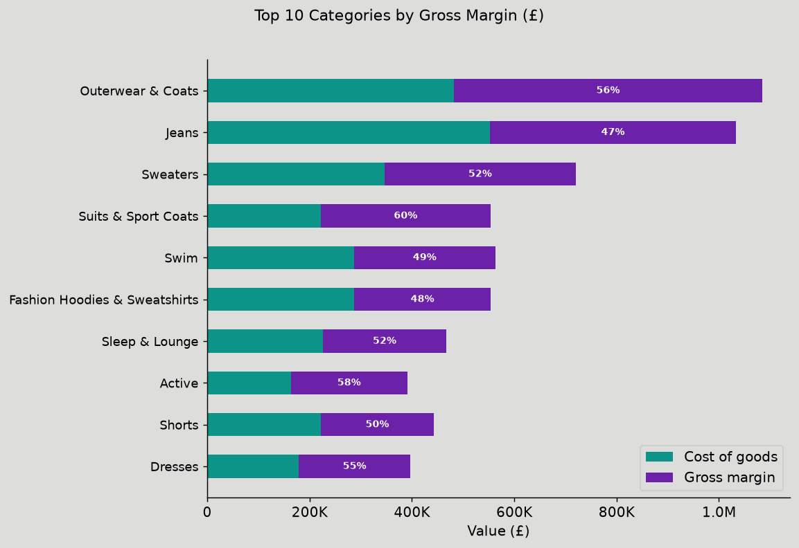
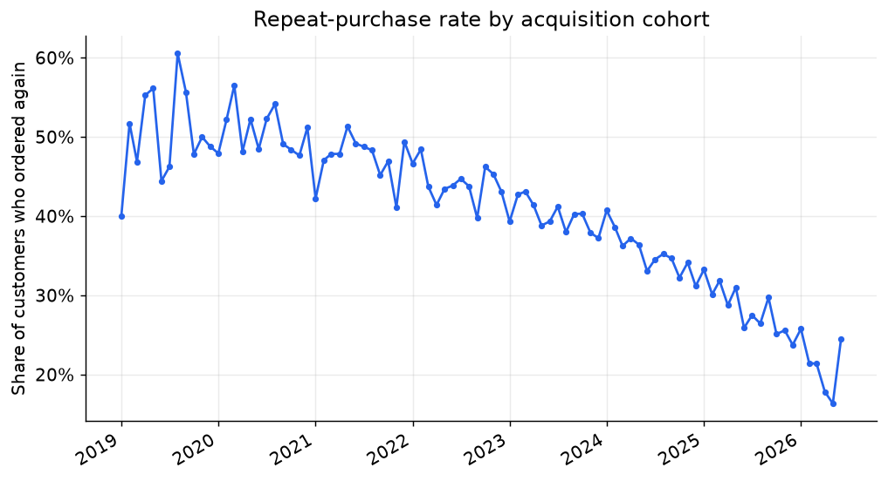
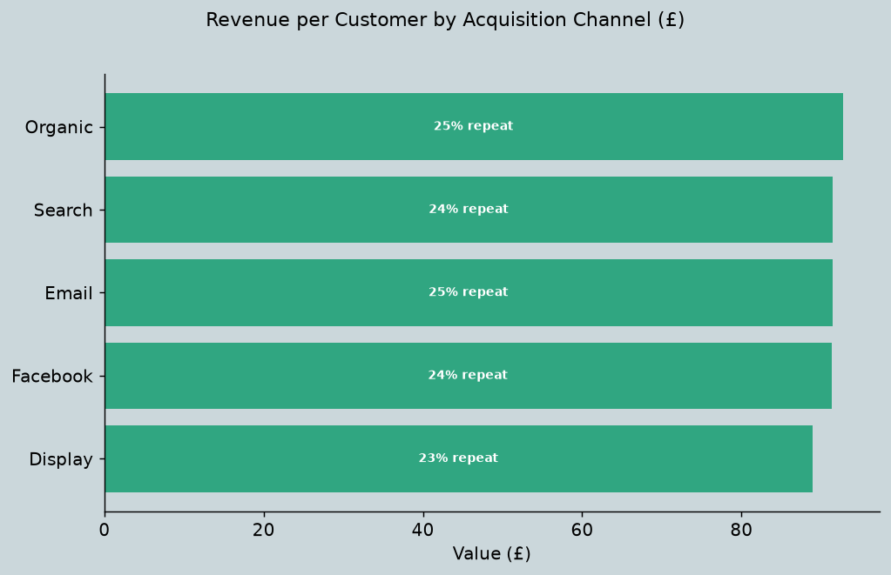
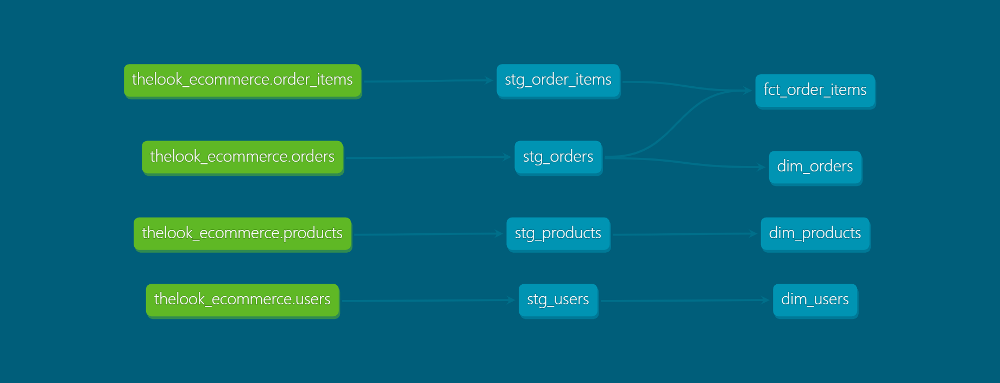

# E-commerce Analytics: from raw transactions to commercial decisions

Most "dbt project" repos stop at building a clean star schema. This one goes a
step further and uses that model to answer three questions a commercial or
product team would actually ask:

1. **Which categories make money** once cost of goods and returns are taken out — not just which ones sell?
2. **Do we keep the customers we win?** What share come back for a second order?
3. **Which acquisition channel** brings the most valuable, stickiest customers?

The data is modelled with **dbt Core** on **BigQuery** (star schema, tested,
documented), then an analytics layer turns it into the findings and charts below.

> **Dataset:** [`thelook_ecommerce`](https://console.cloud.google.com/marketplace/product/bigquery-public-data/thelook-ecommerce) — a Google public BigQuery dataset simulating an online retailer. 181k order items across ~100k customers.

---

## Findings

> _Figures below are produced by [`notebooks/generate_insights.py`](notebooks/generate_insights.py), which reads the marts straight from BigQuery. Charts are regenerated on every run._
>
> ⚠️ _`thelook_ecommerce` is a **synthetic** dataset — prices and costs are generated, not real market data. The figures below illustrate the **method** (how I'd surface these signals on real data), not commercial reality._

### 1. Category profitability ≠ category revenue

Ranking categories by **gross margin (£)** — revenue minus cost of goods —
rather than revenue changes the picture: the chart shows which categories clear
a healthy margin and which barely break even. Return rate is tracked alongside
as a second risk signal — note it is reported per category, not yet deducted
from the margin figure.



- Highest-margin category: **`Blazers & Jackets`** (`62%` margin)
- Lowest-margin category: **`Clothing Sets`** (`38%` margin)
- Highest return rate: **`Clothing Sets`** (`15%` of items returned)

**So what:** a revenue-led view would push spend toward the top-selling
categories; the margin-and-returns view flags where that revenue is actually
profitable and where returns are quietly eroding it.

### 2. Retention is the real story

Grouping customers by the month of their first order and measuring how many
return gives the **repeat-purchase rate** — the single clearest signal of
whether the business is building a customer base or just renting one.



- Overall repeat-purchase rate: **`33.5%`**

> _Caveat: "repeat" here means 2+ orders **ever**, so the most recent cohorts have had less time to place a second order and will read lower for that reason alone — the dip toward recent months is partly an observation-window effect, not pure retention decay. A fixed window (e.g. repeat within 90 days of first order) is the natural next iteration._

**So what:** acquisition is only half the picture. If repeat rate is low and
flat across cohorts, the lever isn't more sign-ups — it's getting existing
customers to a second order.

### 3. Channels are not equal

Channels are easy to judge on sign-up volume; the more useful cut is **revenue
per customer** and **repeat rate** by channel.



- Best channel by revenue per customer: **`Organic`** (£`93`, `25%` repeat)

**So what:** the channel that brings the most customers isn't necessarily the
one that brings the most *value*. This is where budget should follow.

---

## The data model

A standard three-layer dbt architecture — sources → staging (views) → marts
(tables) — with an added analytics layer for the questions above.

```
bigquery-public-data.thelook_ecommerce   (sources)
        │
        ▼
  staging/   stg_orders · stg_order_items · stg_products · stg_users   (views, clean + rename)
        │
        ▼
  marts/     fct_order_items · dim_orders · dim_products · dim_users    (tables, star schema)
        │
        ▼
  marts/analytics/   mart_category_performance · mart_customer_retention · mart_channel_performance
```



| Layer | Models | Materialised as |
|---|---|---|
| Staging | 4 | Views — clean and rename, no business logic |
| Marts (dimensional) | 1 fact + 3 dims | Tables — the star schema |
| Marts (analytics) | 3 | Tables — the question-answering layer |

---

## Data quality

Testing goes beyond "keys are unique". The suite covers:

- **Referential integrity** — every `fct_order_items` row must resolve to a real order, user, and product (`relationships` tests)
- **Accepted values** — order `status` can only be one of the five known states
- **Range checks** — every rate (margin %, return rate, repeat rate) must fall within sensible bounds, so a bad join can't silently produce a nonsensical chart ([`tests/assert_rates_within_bounds.sql`](tests/assert_rates_within_bounds.sql))
- **Uniqueness / not-null** on every primary and foreign key

```
dbt test  →  all passing
```

---

## How this was built (AI transparency)

I used Claude as a pair-analyst on the analytics layer — sounding out which
questions were worth asking of this data, sense-checking the margin and
retention SQL, and tightening this write-up. The dimensional model, the
analysis design, and the interpretation of the findings are mine.

---

<details>
<summary><strong>Run it yourself</strong></summary>

### Prerequisites
- Python 3.12, dbt BigQuery adapter (`pip install dbt-bigquery`)
- A Google Cloud project with BigQuery enabled, authenticated via:

```bash
gcloud auth application-default login --scopes=https://www.googleapis.com/auth/cloud-platform
```

### Build the model and run the tests
```bash
dbt run         # builds staging, marts, and the analytics layer
dbt test        # runs the full test suite
dbt docs generate && dbt docs serve   # browse the lineage graph
```

### Generate the findings and charts
```bash
cd notebooks
pip install -r requirements.txt
python generate_insights.py --project YOUR_GCP_PROJECT --dataset dbt_analytics
```
This writes the three charts into `images/` and prints the headline figures to
paste into the Findings section above.

### Configure `~/.dbt/profiles.yml`
```yaml
my_analytics_project:
  target: dev
  outputs:
    dev:
      type: bigquery
      method: oauth
      project: YOUR_GCP_PROJECT_ID
      dataset: dbt_analytics
      threads: 4
      location: US
```

</details>

---

**Built by [Mahanoor Shams](https://github.com/mayasyed)** · [LinkedIn](https://www.linkedin.com/in/mahanoor-shams)
